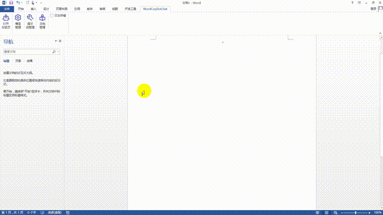
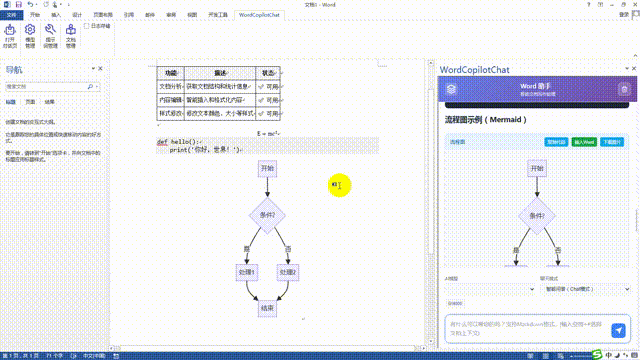
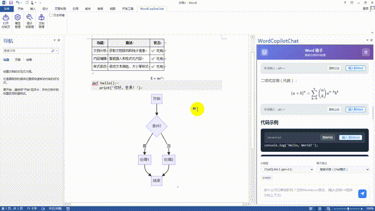
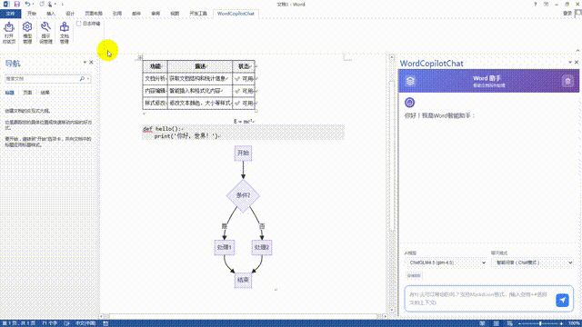
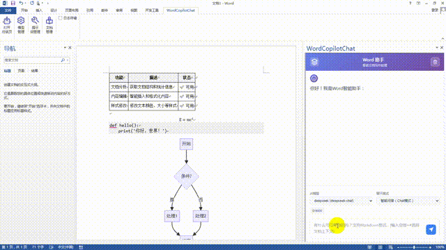
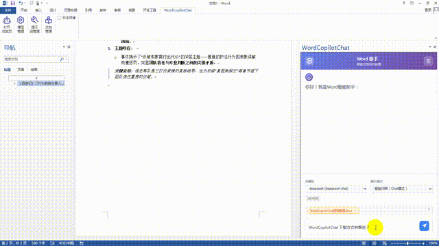
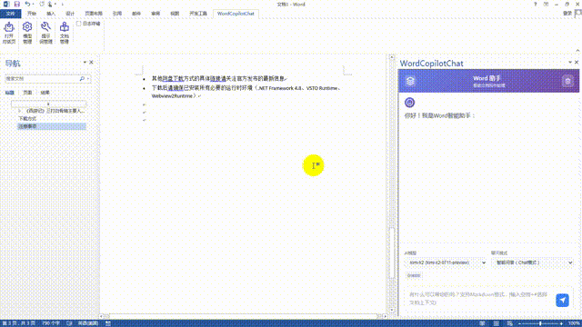
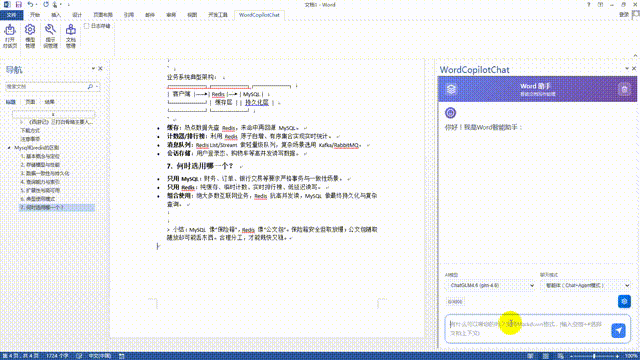

## WordCopilotChat - Word 智能助手（VSTO 插件）

一个面向 Word 的本地智能助手：支持智能聊天、智能体（Agent）直接操作文档、所见即所得的预览与一键应用、标题上下文选择、Markdown/公式/流程图/代码块渲染与插入、模型与提示词可视化管理、加密导入导出等。完全本地运行（通过 WebView2 承载前端 UI），默认不留存隐私数据；项目将以 MIT 协议开放，免费、无商业限制。

说明：本仓库是「WordCopilot」项目中的一部分功能，单独抽取对话功能并且开源。作者时间精力有限，不保证即时维护；如遇严重问题，欢迎提交 Issue 或微信私信联系（见文末“联系与反馈”）。

## 使用教程（在线阅读）
- 语雀： [《WordCopilotChat 使用教程》](https://www.yuque.com/u10028163/fkyye8/oh3fmwlkhmli73d4?singleDoc#)

### 功能特性
- Chat 与 Agent 双模式
  - Chat：常规问答、内容生成，支持 Markdown、代码高亮、KaTeX/MathJax 公式、Mermaid 流程图
  - Agent：直接调用工具操作文档（插入内容、修改样式、获取文档统计/标题/选中文本/表格/图片/公式等）
  - 内联“现代化预览卡片”：先预览、后应用，一键接受/拒绝；支持批量接受/拒绝
- 文档上下文选择
  - 输入框中“空格 + #”即可选择文档/标题作为上下文；也可多选
- 大文档友好
  - 优先“文档统计”获取概况；标题列表支持分页；工具调用过程有进度卡片与日志
- 可视化管理
  - 模型列表（含模板、工具开关、参数）、提示词编辑（支持导入导出）、文档管理（上传、查看、导出/导入）
- 安全与导入导出
  - 导入导出使用 AES-256-CBC + HMAC-SHA256 加密，PBKDF2 派生密钥（见 `utils/EncryptionUtils.cs`）
- 模型适配
  - 已适配国产模型：Qwen、DeepSeek、Kimi、ChatGLM、MiniMax 的最新旗舰模型；支持自定义 BaseUrl / ApiKey / 参数

#### OpenAI API配置注意事项

不同于通过OpenAI SDK（例如Python的from openai import OpenAI）进行模型访问，本项目是直接通过HTTP访问，因此base_url有所不同。

以Qwen为例，通过OpenAI SDK进行访问，base_url应当设置为`https://dashscope.aliyuncs.com/compatible-mode/v1`，
而本项目是通过HTTP访问，base_url应当设置为`https://dashscope.aliyuncs.com/compatible-mode/v1/chat/completions`


### 运行截图（示意）
- 功能区按钮：打开侧边栏、模型列表、提示词设置、文档管理、日志开关
- WebView2 聊天界面：消息气泡、工具预览卡片、悬浮批量操作

> 注：请以实际运行为准，界面持续优化中。

### 演示
以下为部分演示

#### 1. 欢迎语插入


#### 2. 导入模型


#### 3. 欢迎语和提示词


#### 4. 文档上传和解析


#### 5. 文档引用


#### 6. 文档引用


#### 7. Agent插入


#### 8. Agent查询


---

## 快速开始

### 环境要求
- 操作系统：Windows 7 Service Pack 1 及以上（Windows 10/11 推荐）。
- Microsoft Word：最低支持 2013（建议使用 2019 及以上版本；在 Word 2013 中公式插入可能存在兼容性问题）。
- WPS 专业版：兼容 WPS 2016 及以后专业版的基础功能（Chat 模式、渲染、插入）；但 Agent 模式兼容性目前较差，部分工具调用可能无法稳定运行。
- .NET Framework：必须为 4.8 及以上版本（不支持低于 4.8）。下载地址：https://dotnet.microsoft.com/zh-cn/download/dotnet-framework/net48
- Microsoft Edge WebView2 Runtime：
  - Windows 7：最后支持版本为 109（官方已不再提供下载页面，可在第三方渠道获取对应安装包）。
  - Windows 10/11：可从微软官网直接下载并安装：https://developer.microsoft.com/zh-cn/microsoft-edge/webview2/?cs=4112006293&form=MA13LH#download
- Visual Studio 2010 Tools for Office Runtime（VSTO 运行时）：https://www.microsoft.com/zh-cn/download/details.aspx?id=105890

可选（仅限开发者环境）：
- Visual Studio 2019/2022（安装“Office/SharePoint 开发”工作负载）用于编译与调试此 VSTO 插件。

### 获取代码与依赖
1. Clone 仓库
2. 双击打开 `WordCopilotChat.csproj`（或使用 VS 打开所在解决方案/文件夹）
3. 还原依赖（NuGet）：FreeSql、Microsoft.Web.WebView2、Newtonsoft.Json

### 调试运行
1. 在 VS 中设置启动项目为 `WordCopilotChat`
2. F5 启动（首次会启动 Word 并加载该 Add-in）
3. 在 Word 功能区找到 “WordCopilotChat” 相关按钮
   - “打开助手” → 显示右侧 WebView2 聊天面板
   - “模型列表”“提示词设置”“文档管理”“日志开关”等

### 首次配置
1. 打开“模型列表”，新增一个模型（设置 BaseUrl、ApiKey、参数 JSON、是否启用工具）
2. 在聊天面板右上角选择该模型与聊天模式（Chat / Agent）
3. 可在“提示词设置”中自定义 Chat / Agent / Welcome 提示词（支持导出/导入）

---

## 使用指南

### Chat 模式（问答/生成）
- 直接在输入框中提问或给出指令，支持 Markdown/公式/代码/流程图
- 复制/插入到 Word：消息区域提供“复制”和“插入到 Word”
- 欢迎页示例可直接插入（包含表格/代码/公式/流程图）

### Agent 模式（工具驱动）
- 根据输入意图自动收窄工具白名单（避免误操作）
- 典型流程
  1. 获取文档概况：优先使用 “get_document_statistics”
  2. 需要标题时再使用 “get_document_headings”（大量标题请分页）
  3. 插入/修改前：先 “check_insert_position” 检查目标标题与上下文
  4. “formatted_insert_content” / “modify_text_style” 首先产生预览卡片 → 接受后执行
- 工具调用过程会以卡片展示“执行中/完成”状态；可批量接受/拒绝所有待处理预览

### 上下文选择
- 输入框打字时，输入“空格 + #” 即可唤起“标题快捷选择器”
- 支持层级化显示、分页加载、键盘导航、回车插入为 `@标题`

### 文档管理
- “文档管理”窗口支持：
  - 上传并解析（.doc/.docx/.md），可在上传前剔除指定子树标题
  - 最大文档数限制
  - 文档导出为加密包 `.wcdoc`，也可从包导入

### 日志与隐私
- 功能区提供“日志开关”，默认关闭（节省磁盘且更隐私）
- 开启后会写入用户目录 `~/.WordCopilotChat/logs/`（请求/错误）
- OpenAI 请求日志中会对 API Key 做脱敏处理

---

## 目录结构（简要）
```
WordCopilotChat/
  forms/             # WinForms 各类设置/管理窗口 & 侧边栏 UserControl
  services/          # 模型、提示词、文档、应用设置服务（FreeSql + SQLite）
  utils/             # WebView2/OpenAI/Word 工具、文档解析、加密等
  wwwroot/           # 前端（WebView2）资源：index.html、css、js（chat.js 主逻辑）
  Ribbon1.*          # Word 功能区
  ThisAddIn.*        # VSTO 入口，初始化数据库表等
```

---

## 常见问题
- Word 未被正确加载？
  - 请确认已安装与 VS 匹配的 VSTO 组件，并以管理员身份启动 VS 再调试
- WebView2 白屏？
  - 请安装/更新 WebView2 Runtime；或检查 `Microsoft.Web.WebView2` 依赖是否成功还原
- 工具调用无响应？
  - 确认当前模型“启用工具”开关、Agent 模式、以及前端白名单未被收窄
- 大文档卡顿？
  - 先使用“文档统计”，需要标题再分页获取；避免一次性获取整个文档的所有细节

---

## 许可协议
本项目计划采用 MIT License 开源。MIT 是宽松、商业友好的许可证，允许复制、修改、再发布与商业使用，仅需在分发时保留版权与许可声明。非常适合你“免费、无商业限制”的目标。

---

## 特别致谢
张强 —— 我的伯乐与指路人。在我犹疑与摸索的阶段，他在关键节点给予了无价的信任、指引与鼓励，让这个项目能够生根发芽、一路走到今天。将这部分能力以开源的方式分享出去，也是在致敬这份托举与成全。

---

## 开源组件与许可
本项目依赖以下第三方组件（按字母序），感谢开源社区的贡献。具体许可以各项目官方仓库为准：
- [FreeSql / FreeSql.Provider.Sqlite](https://github.com/dotnetcore/FreeSql)
- [highlight.js](https://highlightjs.org/)
- [Marked](https://marked.js.org/)
- [MathJax](https://www.mathjax.org/)
- [Mermaid](https://mermaid.js.org/)
- [Microsoft Edge WebView2](https://learn.microsoft.com/microsoft-edge/webview2/)
- [Newtonsoft.Json](https://www.newtonsoft.com/json)

---

## 致谢
感谢所有热心的使用者、贡献者与朋友们的支持与建议；社区的反馈让项目不断变得更好。

---

## 联系与反馈
- 本项目为「WordCopilot」的部分功能开源版，作者精力有限，维护不承诺即时响应
- 如遇严重 bug：请提交 Issue（附复现步骤/日志），或私信作者微信（可在 Issue 留言索取联系方式）
- 欢迎提交 PR / 建议；如果觉得有用，请点个 Star吧。

### 作者微信
> 添加时请备注“WordCopilot”，仅严重问题或合作沟通  


