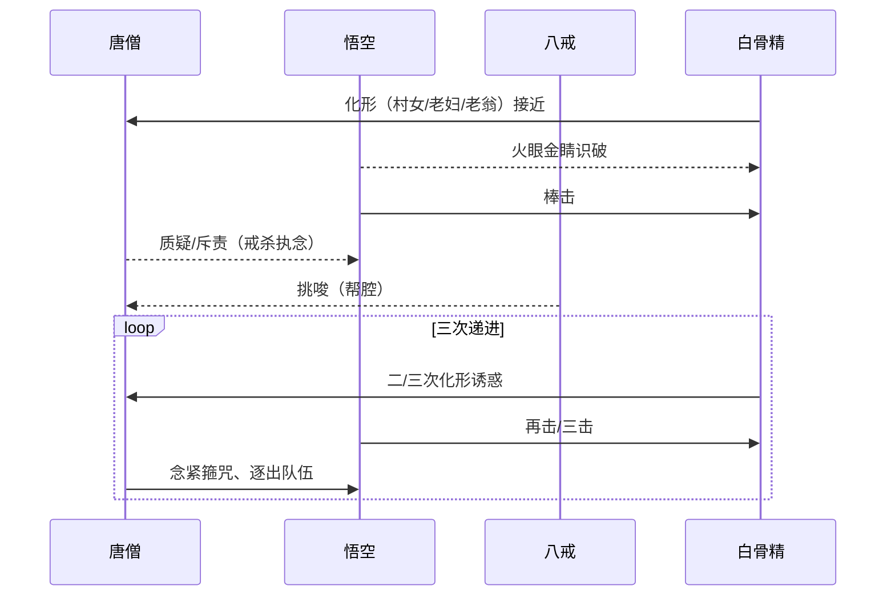

# 《西游记》·第三十六—三十八回「三打白骨精」逐场景拆解

> 适合做产品文档截图：含人物卡、时间线、地点场景、冲突结构、分镜化要点、表格与可视化（Mermaid）

---

## 1. 章节概览
- 对应原著回目：
  - 第三十六回：心猿归正 六贼无踪
  - 第三十七回：鬼王夜谒唐三藏 孙行者大闹黑风山
  - 第三十八回：扫塔辨奇冤 行者施威降怪雾（广义资料亦把“三打白骨精”归于此段）
- 主线目标：西行团队过白虎岭，遇白骨夫人（白骨精）反复化形诱杀唐僧
- 核心矛盾：悟空的「识破与出手」vs 唐僧的「不明而误判」
- 主题母题：识破假象、忠直与误解、团队信任危机、善恶判断的代价

---

## 2. 主要人物（截图建议：做人物卡）
| 身份 | 人名/化形 | 关键词 | 动机 | 能力与法器 |
|---|---|---|---|---|
| 师 | 唐三藏 | 慈悲、戒杀、执着戒律 | 西天取经 | 静定、梵音、警戒心薄弱 |
| 徒 | 孙悟空 | 火眼金睛、刚猛、求实 | 护师、破妄 | 如意金箍棒、筋斗云、火眼金睛 |
| 徒 | 猪八戒 | 好吃懒做、嘴快、墙头草 | 求生、讨好师父 | 九齿钉耙 |
| 徒 | 沙僧 | 稳重、执行力强 | 护送行李 | 月牙铲 |
| 妖 | 白骨精（白骨夫人） | 伪装高手、多层化形、诱杀 | 食唐僧肉长生 | 变化、妖术、障眼法 |

---

## 3. 场景&地点（截图建议：地图或场景卡）
- 白虎岭—白骨洞—岭下村落近郊
- 视觉元素：荒岭、冷风、枯枝、碎骨（暗示“白骨”母题）
- 气氛基调：明暗对照（慈悲的光与欺诈的影）

---

## 4. 时间线（截图建议：表格视图）
| 次序 | 事件 | 白骨精化形 | 悟空行为 | 唐僧/团队反应 | 结果 |
|---|---|---|---|---|---|
| 1 | 初遇诱杀 | 村女 | 识破→棒击 | 唐僧不解，疑悟空滥杀 | 妖精脱身，一具尸体 |
| 2 | 复来引诱 | 老母 | 再次识破→棒击 | 八戒挑拨、师父怒 | 再脱，一具尸体 |
| 3 | 三度试探 | 老父 | 三打→碎尸 | 唐僧信任崩塌，念紧箍咒 | 悟空被逐出团队 |
| 4 | 尾声伏笔 | 夜间滋扰 | 妖雾/小妖 | 悟空离队后难度上升 | 团队临时失护法 |

> 注：这里采用通行“姑娘—老妇—老翁”三化形脉络，便于读者理解“三打”的递进结构。

---

## 5. 核心冲突与结构（可截图：要点清单）
1) 认知冲突：慈悲戒杀 vs. 必要的刚猛护法  
2) 信息不对称：悟空能“见真相”，师徒其余人受「表象/口才」迷惑  
3) 关系冲突：悟空“保护者”身份遭误伤，团队信任临界点（被逐）  
4) 结构节奏：三次化形→三次识破→三次误解→信任崩塌→危机深化

---

## 6. 关键道具/技法卡（截图建议：清单+注释）
- 金箍棒：刚猛正义的器具象征
- 紧箍咒：师徒权力结构的“约束开关”
- 火眼金睛：破妄与辨伪的能力隐喻
- 骨洞遗白：场景物象呼应妖名与主题

---

## 7. 分镜化要点（示例片段）
1) 远景：白虎岭风急、天色晦淡、道旁枯骨  
2) 近景：队伍行进，八戒打趣，唐僧嘱“戒杀”  
3) 特写：远处“村女/老妇/老翁”步入镜头，衣饰朴素、神色可怜  
4) 动作：悟空侧目，火眼金睛闪；镜头切“皮相剥落”的隐喻叠化  
5) 冲突：棒落—尘起—尸现；团队惊惧；口角升级  
6) 情绪：八戒挑唆；唐僧眉结，念咒；悟空苦辩无门  
7) 结点：大圣离队，背影远去；冷风再起，岭上更险

---

## 8. 主题延展（可做知识卡）
- 识破表象与“必要之恶”：护法并非好看，真实往往不圆润
- 团队治理：权力制衡（紧箍咒）与专业判断（火眼金睛）的张力
- 决策风险：信息不对称 + 情绪占优 → 错误的惩罚与更大的代价

---

## 9. Mermaid 时序图（可在预览中渲染）

---

## 10. 适用于截图的「速览页」模块
### A. 人物速览
- 师徒四人 + 白骨夫人（化形 A/B/C）
### B. 场景速览
- 白虎岭风景要素 + 白骨洞入口
### C. 冲突速览
- 三化形三打 → 误解升级 → 悟空离队
### D. 关键词
- 识破、执念、信任、代价、护法

---

## 11. 可复用文案（两段）
> 「表象可以骗过善良，骗不过真知。仁慈若不携带分辨力，就会把仗义者推向孤独。」  
> 「三打不是粗暴的重复，是一次次对‘假’更精准的揭露；而每次揭露，都要付出被误解的代价。」

---

## 12. 延伸阅读/教学提示
- 与「真假美猴王」对照：当“辨伪能力”与“组织权威”冲突时，如何校准决策？
- 团队共识建立：让“专业判断”先行，情绪标签后置

